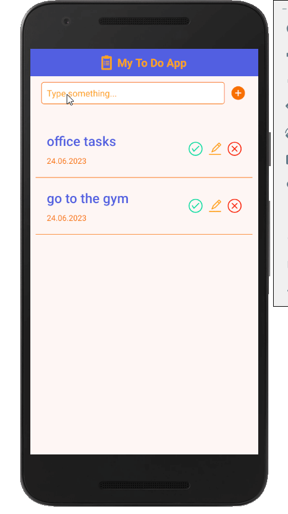

# toDoApp
<h1>Mobile To Do Application</h1>

This is a simple application to keep track of one's daily tasks. It uses the mobile device's local storage to save the tasks.

<h2>Technologies</h2>
<ul>
    <li>React Native</li>
</ul>
<h3>Screenshot</h3>

